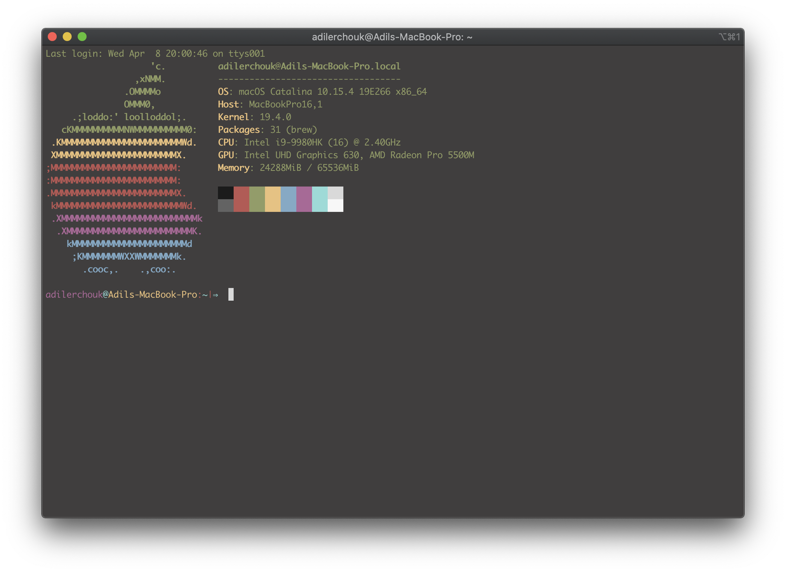

# Setting-Up-MacOS-for-Dev
Useful steps and tips to set up a MacOS for iOS development

## 1. Setup your AppleID

## 2. Setup your terminal emulator

Install [Homebrew](https://brew.sh/), the best package manager for macOS.
In the `Terminal`:

```bash
/bin/bash -c "$(curl -fsSL https://raw.githubusercontent.com/Homebrew/install/master/install.sh)"
```

Install `iTerm2` with Homebrew, `iTerm2` is a good alternative to the `Terminal` included in macOS. 


```bash
brew cask install iTerm2
```

Install Z shell (Zsh), a command shell with very efficient command-line completion, spelling corrections, command history...

On the terminal: 

```bash
brew install zsh
```
Install [Oh My ZSH!](https://ohmyz.sh), a community-driven framework for managing your Zsh configuration.

```bash
sh -c "$(curl -fsSL https://raw.github.com/ohmyzsh/ohmyzsh/master/tools/install.sh)"
```

With `Oh My ZSH!`, you can add useful [plugins](https://github.com/ohmyzsh/ohmyzsh/wiki/Plugins) to your shell, create aliases for commonly used functions, change auto-completion settings, change the [theme](https://github.com/ohmyzsh/ohmyzsh/wiki/Themes) of your shell...
Everything is configurable in the file `.zshrc` that you can find in the root of your user folder: `~/.zshrc`.

You can edit this file using `Vim` by typing in the terminal:
 
```bash
vi ~/.zshrc
```

Or even using TextEdit: 

```bash
open ~/.zshrc
```
At this point you can do whatever personalization you desire.

My setup:

1. Change the color profile of `iTerm2` to the `colorPreset` in this repository. In `iTerm2`:

`Preferences` -> `Profiles` -> `Colors` -> `Color Presets...` -> `Import...`

Select the file `colorPreset.itermcolors`.

2. In `.zshrc`, I set `ZSH_THEME` to `"pygmalion"`.

3. Install [neofetch](https://github.com/dylanaraps/neofetch) to have a pretty launching screen.

```bash
brew install neofetch
```


Your terminal should end up looking like this: 


